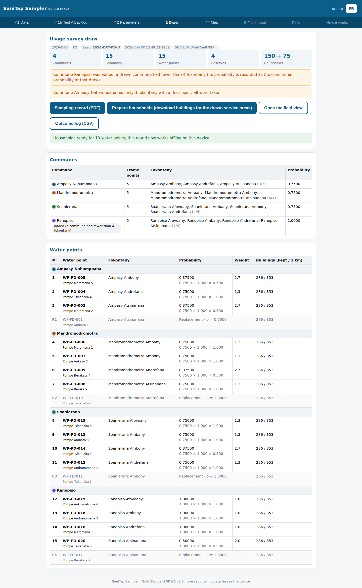

# SaniTap Sampler

A static, offline-capable web tool that draws **statistically valid, logistics-aware samples** for the SaniTap programme under the Gold Standard *Safe Drinking Water Supply* (SDWS) methodology v2.0, in two modes chosen on the Parameters tab:

- **SDWS 18 point-of-use (water quality)** — the original mode, unchanged since v2.2.0 (a regression test proves its draws and records reproduce byte for byte);
- **Usage survey (SDWS 26)** — v2.3.0: a three-stage clustered draw of water points from the carbon fleet and a rooftop draw of households from building footprints, with an offline phone field view. See [Usage survey mode](#usage-survey-mode-sdws-26).

**Live tool:** https://sanitap-water.github.io/sanitap-sampler/ (deployed from `main` by GitHub Actions; works offline after the first load).

Plain HTML/CSS/JS, no build step, no backend, no accounts. All data stays in the browser. Map by [Leaflet](https://leafletjs.com) (cdnjs) with OpenStreetMap tiles.

```
index.html   app shell, styles, print stylesheet
app.js       Core (PRNG, CSV, mWater frame, draw, statistics, PDF record, Excel workbook) + i18n object + UI
sw.js        service worker: caches the app shell for offline use (tiles and the mWater API are never cached)
data/sample-water-points.csv   60 fake points, 3 strata, 4 inactive (CSV-source demo)
bin/file-round.js              files a drawn round under records/ (append-only) and pushes
records/                       filed sampling records, served by Pages (records/index.md is the register)
test/mapper.test.js            Node tests (frame rule, PPS draw, audit, PDF determinism)
test/sdws18-regression.test.js the SDWS 18 mode reproduces every v2.2.0 draw and PDF (test/fixtures/sdws18-baseline.json)
test/usage.test.js             usage-survey mode: reproducibility, stages, probabilities, barrier clip, households, field slots, record
test/screens.py                screenshots of the usage mode (fake frame, synthetic footprints) into docs/screens/
bin/usage-dry-run.js           live dry run of the usage mode for both scenarios (prints counts, no coordinates)
bin/make-sdws18-baseline.js    writes the SDWS 18 baseline; run only to re-baseline on purpose
docs/protocol-annex.md         one-page annex for the SaniTap Water Quality Testing Protocol
.github/workflows/deploy.yml   GitHub Pages deployment; bakes the git commit hash into app.js
```

## Quick start

1. Open the app (GitHub Pages URL below, or just open `index.html` locally / serve the folder with `python3 -m http.server`).
2. **1 Data** — default source is **mWater (live)**: open *mWater connection*, sign in (or paste a token), choose the stratum and press *Fetch from mWater*. Fallback: switch to **CSV file (offline)** and load a frame CSV, or press *Load sample data*.
3. **1b Test A backlog** — the sources of the loaded stratum that still need an SDWS 3 test (see below); optional.
4. **2 Parameters** — round name, *drawn by*, target samples (58) and households per source (5); the stratum is the one loaded on the Data tab and the seed is computed from round and stratum (shown in the *Reproducibility* line). The statistical check settings sit behind *Advanced*. Press *Draw the sample*. Tabs show ✓ when a step is done.
5. **3 Draw** — read the one-sentence design check and the selected sources; export the **Sampling record (PDF)** for the VVB and the **Selection (Excel)** for the team.
6. **4 Map** — numbered markers (1…12, R1…R3) with the same numbers in the stop list beside the map, commune labels, and orange reach flags.
7. **5 Field sheet** — the stop list with GPS, households and the field-rule numbers; print (or *Save as PDF* on the phone).

Every tab ends with a *Next* button to the following one.

Language toggle (EN/FR) is in the header; every label lives in the `I18N` object in `app.js`.

## Inputs

### Source A — mWater (default)

The frame is fetched in the browser from the mWater API (`https://api.mwater.co/v3`, CORS is open) and mapped by `Core.mapMwaterEntities()`.

**Eligibility rule (v1.3).** A source is eligible when it

1. belongs to the MadAvance water point register (mWater group `group:aaaf0a14…`, entity type `water_point`);
2. has at least one **final** result in *Clean Water || Water Quality Testing_SDWS 3_Result* (form `7b33c5d7…`) that meets the **health-based rule**: E. coli = 0 CFU/100 mL, arsenic ≤ 10 µg/L, fluoride ≤ 1.5 mg/L (these three must be present), and, where measured, nitrate ≤ 50 mg/L and manganese ≤ 0.08 mg/L. pH, conductivity, turbidity and iron are recorded by the form but never exclude. The form has no nitrate question yet; the rule entry is in place (`q: null`) and is skipped until one exists;
3. is not abandoned: name not "abondonné / identifié / drilling / proposal / puits ouvert", latest final record of the maintenance form not *Non fonctionnel*, type not kiosk or dug well;
4. lies in a district mapped to a stratum: Taolagnaro and Amboasary-Atsimo (both Anosy) → **HP-FD**, Maroantsetra → **HP-MA**. Beloha (the Marolinta area) is outside the carbon project and excluded; any other district is *unassigned* and excluded.

The exclusions are applied in that order and counted: total in group, SDWS 3 pass count, excluded (no passing result), excluded abandoned, excluded Marolinta, unassigned, eligible per stratum. The counts appear on the Data tab, in the audit record (`input.mwater.counts`) and in the sampling record PDF. The 286 `LR-…` points of the group named SaniTap are not in the register and stay out.

| Sampler column | mWater origin |
|---|---|
| `water_point_id` | entity `code` (the id used in every mWater form) |
| `name` | `name` (pump model) + `alt_id` (pump number) |
| `stratum` | district (`admin_div2`, or the admin-region hierarchy) mapped as above, else `unassigned` |
| `commune`, `fokontany`, `village` | `admin_div3`, `admin_div4`, `admin_div5` |
| `lat`, `lon` | `location.coordinates` |
| `households_served` | latest "Nombre de toits" in *Nombre de bénéficiaires* (form `8aa2dd78…`), used as the stage-1 sampling weight and printed on the field sheet |
| `status`, `status_reason`, `sdws3_*` | result of the eligibility rule, SDWS 3 pass/result counts, last test date and the parameters that failed |
| `alt_id` | pump number as registered in mWater |

The fetched frame is serialised to CSV, hashed with SHA-256 and stored exactly like an uploaded CSV, so the audit record and the reproducibility guarantee are identical for both sources (`input.source` is `mwater` or `csv`). *Download loaded frame* gives the VVB the exact CSV that was hashed.

**Token handling.** Sign-in posts username/password once to `/v3/clients` and keeps only the returned client id; the password is never stored. The token lives in this browser's `localStorage`, is shown masked, travels only as the `?client=` query parameter, is never logged and never written to any export, audit record or PDF. The service worker never caches `api.mwater.co`. Nothing in this repository contains a credential: `MWATER` in `app.js` holds only identifiers (group id, form ids, question ids).

### Source B — CSV (offline fallback)

**Water points CSV** (mWater export), one row per point, columns:
`water_point_id, name, stratum, commune, fokontany, village, lat, lon, households_served, status`
(`latitude/longitude/lng` are accepted as aliases; `status` is `active`/`inactive`).

**Round parameters**: round name (e.g. `2026 R1`), *drawn by*, target number of PoU samples (default 58) and households per source (default 5). The stratum is the one loaded on the Data tab (a CSV frame with several strata gets a selector there). The replacement fraction is fixed at 20 % and the **seed** is computed as `<round without spaces>-<stratum>` (e.g. `2026R1-HP-FD`) and shown read-only. Advanced (collapsed): ICC (default 0.1), expected pass rate (default 0.95), confidence (90 % default, or 95 %), precision type (relative 10 % of p — the CDM convention — or absolute ±0.10).

## How the draw works

Implemented in `Core.draw()` in `app.js`; also shown in the app under *How it works* and written out in every sampling record PDF.

**Random numbers.** The seed string is hashed with `xmur3` into a 32-bit word that seeds a `mulberry32` PRNG. All stages consume the same stream in a fixed order, so the same seed + same frame file + same parameters reproduce the same selection on any device. Records are sorted by identifier (and by commune for stage 1) before drawing, so CSV row order does not matter.

**Frame.** Sources with `status = active` in the chosen stratum (see the eligibility rule above).

**Stage 1 — sources (Protocol v2.2 §6.4, default method `pps_households`).** The eligible sources are ordered by commune then id, each with its households served (sources without a count get the stratum median; the count of imputed weights is in the audit). `n_wp = ceil(target / households_per_source)` sources are drawn by **systematic PPS**: interval = total households / n_wp, one random start in [0, interval), and the source containing start + k × interval is selected for k = 0 … n_wp − 1. Ordering by commune spreads the selection across communes in proportion to their households. A source with more households than the interval is selected with certainty and the interval is recomputed on the rest, so no source is hit twice. The **replacement list** (`ceil(replacement_fraction × n_wp)` sources) is then drawn one by one from the remaining sources with probability proportional to households, in draw order. The audit records total households, interval, random start, certainty selections and, per selected source, its weight, cumulative range and hit position.

**Stage 2 — households.** Every source uses the **field rule** of Protocol v2.2 §6.4: count the households served (K) and draw N random numbers between 1 and K (+2 replacements, kept internally); for each number k, sample the k-th household met when walking from the source. The numbers are generated when K is typed, from a PRNG seeded with `seed|water_point_id|K=K`, so they are reproducible and are appended to the audit record. Sterile equipment, no flaming; the purge and all sampling steps are recorded on the mWater form (SDWS 22 PoU) together with the record id.

**Reach check.** Each selected source is compared with the nearest other selected source and with the district town (Fort-Dauphin or Maroantsetra). A source farther than 25 km from both is flagged orange on the map, in the stop list, on the field sheet and in the PDF with the text "Far from the rest: replace in the field only if unreachable, and record the reason". The audit record keeps the distances (`reach_check`); nothing is replaced automatically.

**Statistical check.** Design effect `DEFF = 1 + (m − 1) × ICC` (m = households per point). Effective sample size `n_eff = n_wp × m / DEFF`. Required size for a proportion at expected pass rate p under the CDM 90/10 rule: `n_req = z² p(1 − p) / d²`, z = 1.645 (90 %) or 1.96 (95 %), d = 0.1 × p (relative) or 0.10 (absolute). If `n_eff < n_req` the tool warns and suggests (a) fewer households per point and hence more water points/clusters, or (b) more water points at the same m.

**Record.** Each draw produces the sampling record (PDF) described under Outputs; the complete machine-readable audit (seed and its 32-bit word, algorithm, tool version and commit, frame source and SHA-256, eligibility counts, parameters, stage-1 numbers, statistics, communes, sources with weights and hit positions, replacements, reach check, field rule, warnings and the field-rule numbers generated with K) is attached inside the PDF as `audit.json`, and its SHA-256 is printed in the PDF footer. It is the evidence of random selection retained for the VVB.

## Usage survey mode (SDWS 26)

Choose **Usage survey (SDWS 26)** under *Survey* on the Parameters tab. It samples households for the annual usage survey (SDWS 26, with SDWS 25 and SDWS 22) to VPA-DD B.7.2 (90/10, at least 100 households and 8 clusters per scenario) and is run to SOP-MAD-SDWS26 (usage survey).

**Frame.** The carbon fleet of each scenario — HP-FD (Taolagnaro and Amboasary-Atsimo) and HP-MA (Maroantsetra). The mWater register is fetched as for the SDWS 18 mode, behind the user's own mWater login, and joined with the programme report's register classification (`register_classification.json` on the report site: water point ids and classes only, no coordinates); the fleet is the points classed *in_fleet* or *joins* (successfully rehabilitated plus completed new constructions). Marolinta (Beloha) is outside it. There is **no SDWS 3 eligibility filter**: broken pumps stay in the frame. A CSV frame is used as it is (demo/offline). The frame is serialised and hashed (SHA-256); the fleet file's own hash and fetch time go into the record.

**Draw** (`Core.drawUsage`), seeded `<round>-<scenario>-U` (xmur3 → mulberry32), reproducible from seed + frame hash:

1. **Communes**: 3, by systematic PPS on the number of frame points per commune (communes in name order, one random start; a commune larger than the interval is taken with certainty). A drawn commune with fewer than 4 fokontany is taken whole, and a further commune is drawn by sequential PPS among the remaining communes, until 12 fokontany are drawn; its recorded probability is the conditional probability at that draw.
2. **Fokontany**: 4 per drawn commune, simple random sampling among fokontany with at least 1 frame point.
3. **Water points**: 1 per fokontany at equal probability; 1 **reserve** per drawn commune at equal probability among its undrawn points.

Each point's overall probability (commune × fokontany × point) and inverse-probability weight are recorded. The map colours the points by commune; the stop list is grouped by commune.

**Households.** For every drawn and reserve water point, *Prepare households* reads the building footprints within 1 km and the barrier network, and keeps the buildings whose centre lies in the service area:

- **Barriers** follow the report's `sdws1_barrier_clip.py` rule: OpenStreetMap `natural=coastline`, `waterway=river` and `waterway=canal` are barriers; `waterway=stream` is not; a barrier segment within 40 m of `bridge=*` or `ford=*` is a crossing. The circle is cut on a 10 m raster and flood-filled from the water point, so exactly the fragment containing it is kept (the Python clip's "polygon fragment that contains the water point").
- **Buildings**: the report has no footprint dataset (its roof-count census is the field count "Nombre de toits" on the beneficiaries form), so the source is **Google Open Buildings v3**: the Google layer (`bf_source = google`) of VIDA's Google–Microsoft combined dataset, served as one FlatGeobuf file per country on Source Cooperative (`…/by_country/country_iso=MDG/MDG.fgb`, CORS open, spatially indexed).
- **Draw**: the kept buildings are sorted by a stable key and 10 are drawn, plus 5 reserves, in random order from `seed|water_point_id|B=<count>`.

**How footprints reach the phone, and why this is private.** The browser reads the FlatGeobuf file with HTTP range requests for the bounding box of each drawn service area only (a few hundred kilobytes each), and asks Overpass for the barriers in the same box. The result — the round with its water point positions and drawn buildings — is stored in **IndexedDB on that device only**. Nothing is committed to this repository or served from GitHub Pages; the service worker never caches those requests. This is the simplest compliant route: no server of ours, no extract to host, and the public source is only ever asked about the areas actually drawn. Once a round is prepared the field view works offline (map tiles when online; footprints, positions and the outcome log from IndexedDB). Prepare the round on the phone that goes to the field (or on each phone), while online.

**Field view** (tab *Field*, phone): choose the water point; the next building is shown on the map with its distance and bearing from the phone's GPS, and its **draw position** (1–15), which is entered on the mWater response. Buttons: *Interviewed*, *Refused*, *Nobody home* (the building closes after 3 visits), *Not a dwelling*, *Out of area*, *Far side of an unfordable river*. Every closed non-interview opens the next reserve, strictly in order; the water point is done at 10 interviews. *Outcome log (CSV)* exports every entry (record id, water point, draw position, primary/reserve, outcome, visit, time, team) for filing — no coordinates.

**Record.** *Sampling record (PDF)* carries the seed and frame hash, the fleet file hash, the stage-1 numbers, the drawn communes, fokontany and water points with probabilities and weights, the reserves, and, once prepared, the building count per service area (within 1 km, kept after the clip, area kept, barriers, and the SHA-256 of the building list). The full audit is attached as `audit.json`. Like the SDWS 18 record it is byte-reproducible and carries **no coordinates** (tested).

**Dry run.** `FGB_DIR=<folder with node_modules/flatgeobuf> node bin/usage-dry-run.js --env ~/mwater-mcp/.env --round 2026-DRY` draws both scenarios on the live frame, prepares every service area as the phone does, and prints ids, probabilities, weights and building counts only.



Screenshots (`python3 test/screens.py`) use the fake sample frame and synthetic footprints: [laptop draw](docs/screens/usage-laptop-draw-1440.png), [laptop map](docs/screens/usage-laptop-map-1440.png), [phone field view](docs/screens/usage-phone-field-390x844.png).

### Barrier clip parity

The service-area clip uses the same rules as the report's SDWS 1 people-served method of record (`sdws1_population.py` / `sdws1_barrier_clip.py`, since edition 5, 16 Sep 2026), pinned by `test/barrier-parity.test.js`:

- barriers: `natural=coastline`, `waterway=river`, `waterway=canal`; `waterway=stream` is not a barrier;
- crossings: ways tagged `bridge=yes|viaduct|boardwalk`, and nodes or ways tagged `ford=yes|stepping_stones|boat`. Any other value (`bridge=no`, `aqueduct`, `culvert`, …) does not open a river. Before v2.3.1 any `bridge=*` or `ford=*` did;
- a barrier is opened within 40 m of a crossing;
- only the fragment of the 1 km circle that contains the water point is kept. A barrier line has no width: cells on the line that touch the kept fragment count as kept area (v2.3.1).

Known difference, in the report and not the Sampler (found 30 Sep 2026). The report clips each river line to the circle and then calls shapely `split()`. The clipped line ends miss the circle's boundary by rounding, so on many points the split returns the whole circle, and a river that crosses the circle cuts nothing. Run on the report's own OSM extract for the 31 dry-run service areas, the two agree within about 2 points of area wherever the report's split succeeds. Where it fails they differ by up to 39 points, and extending the report's line ends by 2 m brings it to the Sampler's figure. The Sampler applies the rule as written.

## Outputs

- **Map**: selected sources numbered in draw order, replacements grey (`R1…`), commune labels, OSM tiles, a *Fit* button and a *Show on map: draw / Test A backlog* toggle; a stop list under the map with the same numbers (id, pump no., name, commune, fokontany, households, reach distances).
- **Field sheet** (print stylesheet): the stop list only — number, id and name, commune and fokontany, GPS, households served, K box and the pre-generated household numbers — plus the record id and the line "Sampling steps and results are recorded in the mWater form (SDWS 22 PoU); enter the record id on every form". It carries coordinates and is never filed.
- **Sampling record (PDF)** — the record. Built entirely in the browser with pdf-lib 1.17.1 (cdnjs, cached for offline use), in the UI language, as a narrative a validator can follow: identification (programme, stratum, round, draw time, drawn by), method (Protocol v2.2 §6.4), frame (rule in words, mWater source and counts, frame SHA-256), randomness (seed, PRNG, exact reproduction steps), design check (n, sources, m, p, required n for 90/10, ICC, DEFF, effective n, pass/fail), tables of selected and replacement sources with K values, the field rule and the reach check, and a footer on every page with the record id, the audit SHA-256, the tool version and commit, and page x of y. The seed and frame hash are also in the PDF's document properties. The complete audit is attached inside the PDF as `audit.json`. The file is byte-identical for the same draw (its dates are set to the draw timestamp) and contains no coordinates and nothing from the API token.
- **Selection (Excel)** — the data. A real `.xlsx` built in the browser with SheetJS 0.18.5 (cdnjs), three sheets: *Selected sources* and *Replacements* (number, id, pump no., name, commune, fokontany, households, K, household numbers, replacement numbers, reach flag) and *Parameters* (round, stratum, drawn by, date, record id, seed, frame hash and source, counts, target, sources, households per source, ICC, DEFF, effective n, required n, check result, tool). No coordinates.

## Offline, updates and storage

After the first load `sw.js` caches the app shell and the Leaflet and pdf-lib files from cdnjs; the app then opens without a connection (map tiles and the mWater API are never cached). The cache is named after the build commit (baked into `sw.js`, `app.js` and the `app.js?v=` script URL in `index.html` by the Pages workflow, shown in the header), so a new build always loads a new script URL that no HTTP cache can serve stale. `index.html` and `app.js` are fetched network-first with revalidation, so a reload after a deploy gets the new build, and a page that stays open checks for a new worker when its tab regains focus and every 30 minutes; when a newer build activates, a banner *New version available — Reload* appears. Pages still running a build older than 1.4.0 have no banner: their first reload installs the new worker and their second reload shows the new build. Loaded CSV text, the last draw parameters and K values are kept in `localStorage` on the device; *Clear stored data* removes them. The last draw is recomputed from its stored parameters on reload (it is deterministic).

## Real data

The programme frame is the MadAvance group in mWater (about 900 private `water_point` entities and the household entities created by the surveys). A second group named SaniTap holds 286 `LR-…` points that no form references; they are not the monitoring frame. Exports of real coordinates go in `data/real/`, which is git-ignored and never published.

## Testing

Mapper, draw, record and export tests (Node 18+, no dependencies):

```bash
node --test test/*.test.js
```

Set `PDFLIB_DIR` to a folder containing `node_modules/pdf-lib` (1.17.1) to include the PDF tests. `test/sdws18-regression.test.js` compares every SDWS 18 draw (18 on the sample frame, 4 on the mWater-shape fixture) and six record PDFs with the baseline that v2.2.0 wrote before the usage mode existed; a change that moves any of them fails.

## Filing a round

Every drawn round is filed in `records/<round>/<stratum>/` and served by Pages at `https://sanitap-water.github.io/sanitap-sampler/records/<round>/<stratum>/`:

```bash
# after exporting the PDF (and the Excel file) put them in ~/Downloads, or pass paths
node bin/file-round.js                       # newest sanitap-*-record.pdf and -selection.xlsx in ~/Downloads
node bin/file-round.js --pdf x.pdf --xlsx x.xlsx --frame frame.csv   # explicit paths; --frame verifies the frame CSV against the hash in the record
node bin/file-round.js --dry-run             # verify only
```

The script reads the audit attached inside the PDF, checks that its SHA-256 equals the value in the PDF footer and that the record ids match, refuses files with coordinates, copies the PDF as `sampling-record.pdf` and the Excel file as `selection.xlsx`, writes `selection.csv` (mWater import layout) from the attached audit, appends a line to `records/index.md`, commits and pushes. The frame CSV is verified but never copied: it holds coordinates. The record folder is **append-only**: an existing `records/<round>/<stratum>/` is never overwritten; a re-draw gets a new seed and a new round name. The only exception is the folder `records/test/`, used for rehearsals.

## Link between mWater and a sampling record

There is no write-back from the tool to mWater. The link from mWater to a sampling record is the **record id** (`<round>-<stratum>-<seed>`, printed on the sampling record and the field sheet) entered on each PoU form response in mWater. Records are published under `records/<round>/<stratum>/` on this site and copied to the monitoring report folder of the round. The `selection.csv` written at filing time is in the mWater import layout for a custom table.

**Published record files carry no coordinates.** The sampling record PDF, the Excel file and the selection CSV contain identifiers, pump names, communes, households served and k-values only. The field sheet (with GPS positions) and the map are downloads for the field team and are never filed; the frame CSV is kept in the private archive (`bin/file-round.js --frame` verifies its hash without publishing it). The test suite fails if any file under `records/` contains a latitude/longitude field.

## If the app shows an old version

Open `https://sanitap-water.github.io/sanitap-sampler/reset.html` (linked as *Reset app* on the *How it works* tab). The page is never cached: it unregisters every service worker and deletes every cache, keeps `localStorage` (the mWater token, settings, last draw), then loads the plain URL, which fetches the current build. `./?reset=1` does the same from inside `index.html`, but a worker older than 1.4.0 serves that address from its cache, so `reset.html` is the address to give to someone stuck on an old version. The header shows the build hash to confirm.

## Reconciliation (SDWS 3 and crediting)

```bash
node bin/reconcile.js --env ~/mwater-mcp/.env        # or MWATER_TOKEN / MWATER_USERNAME+MWATER_PASSWORD in the environment
```

Writes `sdws3_reconciliation.csv` to the Windows Downloads folder (`/mnt/c/Users/bushp/Downloads`, else `~/Downloads`) with one row per water point of the MadAvance group and no coordinates: id, alt_id, registered pump name, pump type from maintenance, name pattern (identifié / drilling / abandonné / normal), district, commune, stratum, eligibility status and reason, SDWS 3 tested (Y/N), last test date, passes the health rule (Y/N), failing parameters, eligible (Y/N), installation date (earliest end-of-works date of a rehabilitation record), rehabilitation record (Y/N, from the maintenance form's *Première réhabilitation* records and the *Suivi avancement nouveau forage et réhabilitation* form; no form is named SDWS 2), last maintenance visit, households served (*Nombre de toits*), first seen (earliest response referencing the point in any programme form that links water points), and `status_for_crediting`:

| Status | Rule |
|---|---|
| `outside-carbon` | district Beloha (Marolinta) |
| `abandoned` | name "abondonné" or latest maintenance record not functional |
| `credited-eligible` | rehabilitation record and a passing SDWS 3 result (and eligible) |
| `operating-untested` | rehabilitation record, maintenance visit or beneficiaries count, but no SDWS 3 result |
| `not-yet-built` | name "identifié" or "drilling" and no records |
| `other` | anything else; `crediting_note` says why (tested but failing, passing without rehabilitation record, no records) |

`marolinta_class` classifies the Marolinta register entries, which are not all pumps: `rehabilitated` (a rehabilitation record or end-of-works date), `new borehole` (name contains forage/drilling/nouveau and first seen in 2026), `assessment` (first seen in the August 2025 assessment series, no rehabilitation record) or `other`. `duplicate_candidate` (Y/N) and `duplicate_pair_ids` flag probable duplicate register entries there: the commune holds about 90 entries for about 50 real points, from an August 2025 assessment series (generic names IndiaMark / Pompe à cordes / Puits ouvert, first seen 2025-08-22 to 24), a June 2026 registration series (first seen 2026-06-11 to 16) and "Drilling" placeholders. Entries of different series in the same commune within 50 m of each other are flagged and printed as pairs; coordinates are used for the check but never written.

_Generated 2026-09-09 by `bin/reconcile.js` from 908 water points of the MadAvance group, 732 final SDWS 3 results, rehabilitation records for 784 points._

**Per district × crediting status**

| district | total | credited-eligible | operating-untested | not-yet-built | abandoned | outside-carbon | other |
|---|---|---|---|---|---|---|---|
| (none) | 1 | 0 | 0 | 0 | 0 | 0 | 1 |
| Amboasary-Atsimo | 1 | 0 | 0 | 0 | 1 | 0 | 0 |
| Ampanihy Ouest | 1 | 0 | 0 | 1 | 0 | 0 | 0 |
| Antananarivo Renivohitra | 1 | 0 | 0 | 0 | 0 | 0 | 1 |
| Beloha | 91 | 0 | 0 | 0 | 0 | 91 | 0 |
| Maroantsetra | 636 | 599 | 9 | 0 | 14 | 0 | 14 |
| Moramanga | 1 | 0 | 0 | 0 | 0 | 0 | 1 |
| Taolagnaro | 176 | 124 | 7 | 0 | 40 | 0 | 5 |
| TOTAL | 908 | 723 | 16 | 1 | 55 | 91 | 22 |

"Other" breakdown: no records 15; passing SDWS 3, no rehabilitation record 4; tested, failing 3.

Marolinta (Beloha): 27 programme pumps (rehabilitated 13 + new boreholes 14) among 90 register entries, outside the carbon frame; 24 assessment entries (Aug 2025) and 39 other. Probable duplicate register entries (different series within 50 m): 47 entries in 31 pairs, flagged in `duplicate_candidate`.

**Operating but untested (16)**

| id | alt_id | name | district | commune | last_maintenance_visit | households_served | records |
|---|---|---|---|---|---|---|---|
| 847071188 |  | Point d'eau identifié | Maroantsetra | Andranofotsy | 2025-05-30 |  | maintenance |
| 841871296 |  | Point d'eau identifié | Maroantsetra | Anjanazana | 2025-05-30 |  | maintenance |
| 846562715 |  | Point d'eau identifié | Maroantsetra | Anjanazana | 2025-05-30 |  | maintenance |
| 905251482 | N/A | Pompe aspirante  | Maroantsetra | Anjanazana | 2025-05-30 |  | maintenance |
| 905251499 |  | Canzee | Maroantsetra | Anjanazana | 2025-05-30 |  | maintenance |
| 833033404 |  | Point d'eau identifié | Maroantsetra | Ankofabe | 2025-05-30 |  | maintenance |
| 833033411 |  | Point d'eau identifié | Maroantsetra | Ankofabe | 2025-05-30 |  | maintenance |
| 833066068 |  | IndiaMark | Maroantsetra | Maroantsetra | 2025-05-29 |  | maintenance |
| 835481092 |  | Canzee | Maroantsetra | Maroantsetra | 2025-05-29 |  | maintenance |
| 987623074 |  | Canzee | Taolagnaro |  | 2025-08-22 |  | maintenance |
| 742895223 |  | Canzee | Taolagnaro | Mahatalaky | 2024-05-30 |  | rehab+maintenance |
| 742895357 |  | Canzee | Taolagnaro | Mahatalaky | 2024-06-01 |  | rehab+maintenance |
| 742895364 |  | Canzee | Taolagnaro | Mahatalaky | 2024-06-01 |  | rehab+maintenance |
| 742895388 |  | Canzee | Taolagnaro | Mahatalaky | 2024-06-01 |  | rehab+maintenance |
| 742895711 |  | Canzee | Taolagnaro | Manantenina | 2025-01-17 |  | rehab+maintenance |
| 742895113 |  | Canzee | Taolagnaro | Ranopiso | 2025-04-27 |  | rehab+maintenance |

## Deployment

Push to `main`; the workflow in `.github/workflows/deploy.yml` publishes the repository root to GitHub Pages (set *Settings → Pages → Source: GitHub Actions* once). The app is then served at

```
https://<owner>.github.io/sanitap-sampler/
```

The SaniTap-water deployment is https://sanitap-water.github.io/sanitap-sampler/.

All paths are relative, so it also works from any sub-folder or from a local file.

## References

- Gold Standard for the Global Goals, *Safe Drinking Water Supply* methodology, v2.0.
- UNFCCC CDM, *Standard: Sampling and surveys for CDM project activities and programmes of activities* (multi-stage cluster sampling; 90/10 confidence/precision).
